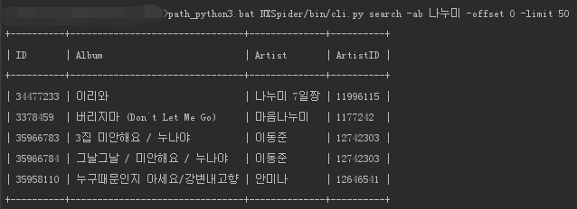
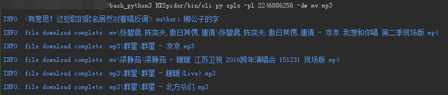
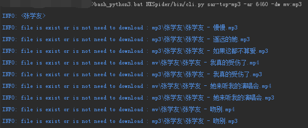
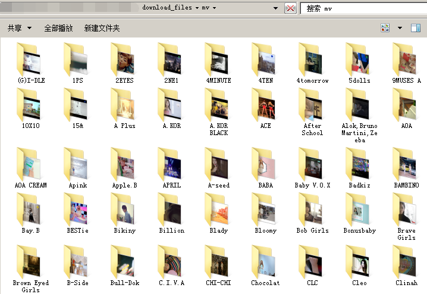
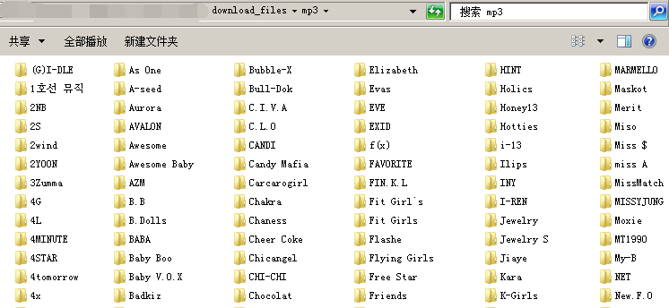
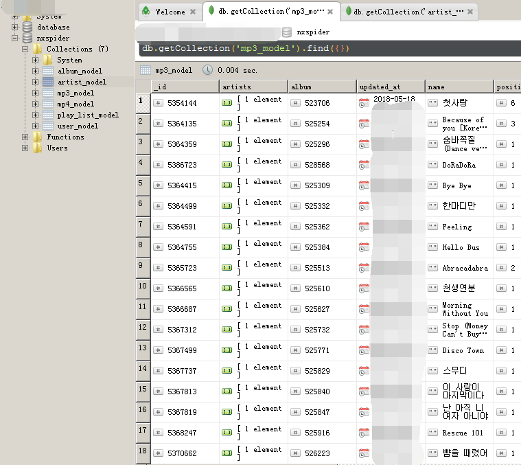

NXSpider
=================

NXSpider， NetEase X Spider，一个强大的（网易云音乐）mp3,mv爬虫，可以下载和收集mp3,mv信息,同时附带多媒体标签信息。采用python编写，mongo数据库(非必须)，递归算法核心实现

[](LICENSE.md)


[新手先看这里](SIMPLE_USE.md) | [历史版本在这里](VERSION.md) | [开发详情在这里](DEV.md)

## 灵感来自

[chengyumeng/spider163](https://github.com/chengyumeng/spider163)

[Binaryify/NeteaseCloudMusicApi](https://github.com/Binaryify/NeteaseCloudMusicApi)

[darknessomi/musicbox](https://github.com/darknessomi/musicbox)

[sqaiyan/netmusic-node](https://github.com/sqaiyan/netmusic-node)

## 功能特性
1. 采用命令行形式运行，配置在个人账号目录下```~/.nxspider/```
2. 搜索歌单，歌手，专辑，用户等信息
3. 通过各种方法，如歌单，歌手，专辑等，下载mp3, mv
4. 所有信息会保存在mongodb中（optional）
5. 所有mp3, mv可以通过配置，增加多媒体标签信息(歌手，专辑，唱片，163comment!!!)

## 运行依赖
1. python3(推荐) or python2, 请配置好path
2. windows or linux
3. [mongodb](https://docs.mongodb.com/manual/installation/)(默认非必需)

## Git clone安装
    $ git clone https://github.com/Grass-CLP/NXSpider.git && cd NXSpider
    $ python(3) setup.py install
    $ pip(3) install -r requirememts.txt # optional, if you use mongodb

## 使用指南
### 简单示例
	$ nxspider -h
	# 显示帮助信息

	$ nxspider -v
	# 显示软件版本信息

### 配置, <>内容为值，or为可选
	$ nxspider config-spider -path <you_download_path,default>
	# 强烈建议第一次前进行配置
	# 配置下载文件的路径，第一个路径为存储路径，其他路径会检查文件是否下载 

	$ nxspider config-mongo -mh <host> -mp <port> -mn <db name>
	# 配置mongodb服务器(非必需)，必须pip安装 requirements

	$ nxspider config-check
	# 检查配置内容

### 搜索命令
	# 以下为搜索命令，其中<>内文具体的文字内容，可以输入中文，韩文，日语等
	$ nxspider search -ar <artist> [-offset <offset>] [-limit <limit>]
	$ nxspider search -pl <playlist> [-offset <offset>] [-limit <limit>]
	$ nxspider search -ur <user> [-offset <offset>] [-limit <limit>]
	$ nxspider search -mp3 <song> [-offset <offset>] [-limit <limit>]
	$ nxspider search -ab <album> [-offset <offset>] [-limit <limit>]
	$ nxspider search -mv <mv> [-offset <offset>] [-limit <limit>]

### 爬取命令
	$ nxspider sab -ab <album_id,id1,id2> [-dw <mv,mp3>]
    $ nxspider sab -ab 3084625,3107072 -dw mv,mp3
	# 根据专辑id(按逗号隔开)爬取歌曲，下载mp3,mv(参数配置)

	$ nxspider spls -pl <playlist_id,id2,id3> [-dw <mv,mp3>]
	# 根据歌单id(按逗号隔开)爬取歌曲

	$ nxspider sar-top-mp3 -ar <artist_id,id1,id2> [-dw <mv,mp3>]
	# 根据歌手id爬取该歌手top50首

	$ nxspider sar-albums -ar <artist_id,id1> [-dw <mv,mp3>] [-offset <offset>] [-limit <limit>]
	# 根据歌手id爬取该歌手第<offset>个开始共<limit>个专辑，offset默认0，limit默认50

	$ nxspider sur-pls -ur <user_id> [-dw <mv,mp3>] [-offset <offset>] [-limit <limit>]
	# 根据用户id爬取该用户的所有歌单（包括收藏）

	$ nxspider scls-pls -cls <class type> [-dw <mv,mp3>] [-offset <offset>] [-limit <limit>]
	$ nxspider scls-pls -cls 全部 -dw mv,mp3 -offset 0 -limit 20
	# 根据歌单分配，爬取该分类下最火歌单

	$ nxspider stop-mvs [-offset <offset>] [-limit <limit>]
	# 爬取最火mv

### 其他命令
	$ nxspider sw_ur_pl
	# 显示所有歌单分类

	$ nxspider config-mongo -nomongo <1 or 0>
	# 配置是否使用mongo存储数据，默认不使用，1为不使用，0为使用

	$ nxspider config-spider -mvr <240 or 480 or 720 or 1080>
	# 配置下载mv最高的分辨率，默认720

	$ nxspider config-spider -tag <1 or 0>
	# 配置是否为媒体文件增加媒体标签，默认1

	$ nxspider config-spider -tag163 <1 or 0>
	# 配置是否为媒体文件增加网易云音乐app特定信息媒体标签，默认1

	$ nxspider config-check
	# 检查配置正确性，并修复部分错误配置

	$ nxspider sw-ar-ab -ar <artist_id> [-offset <offset>] [-limit <limit>]
	# 通过歌手id打印该歌手的唱片信息

	$ nxspider login-smv -lu <user name or phone number> -lp <password>
	# 不建议使用，登录后爬取自己收藏的所有mv

	$ nxspider login-spls -lu <login user> -lp <login password> [-dw <mv,mp3>]
	# 不建议使用，登录后爬取自己所有歌单（包括收藏），下载mp3和mv（记得别忘输入 -dw mp3,mv）

	$ nxspider config_clear
	# 恢复所有设置到默认，建议执行后进行配置下载目录

	$ nxspider -h
	# 更多命令请参考这个

### 部分命令效果图






### 小tips
- 默认配置须关心的为：不使用mongo + 下载路径为 `~/.nxspider/donwload_files/`
- 使用mongo的话，**强烈要求**执行 `pip(3) install -r requirememts.txt`
- 配置 ```-tag163 1``` 直接把下载目录添加到PC版某云软件的下载目录下，软件会自动识别已下载
- 关闭爬取，目前代码是幂等运行，暂时建议直接 ```ctrl + c``` 强制关闭即可


### 系统兼容
| 系统及平台  |   结果     |
|   ---     |    ---    |
| win7(GBK) + python2 | 字符集问题 |
| win7(GBK) + python3 | 通过 |
| win10(GBK) + python2 | 字符集问题 |
| win10(GBK) + python3 | 通过 |
| centos7.2(utf8) + python2 | 通过 |
| centos7.2(utf8) + python3 | 通过 |
| mac + python | 待补充 |
</table>

### 效果图示例
- 已下载mv



- 已下载MP3



- 已采集数据



## 最后
- 程序关闭，建议直接关闭console或 `ctrl+c`
- 希望能给我加个★
- 有其他问题请到issue下留言，或者发邮件给我LipsonChan的雅虎邮箱
- 提交issue的话建议先阅读 [Contributing](CONTRIBUTING.rst)