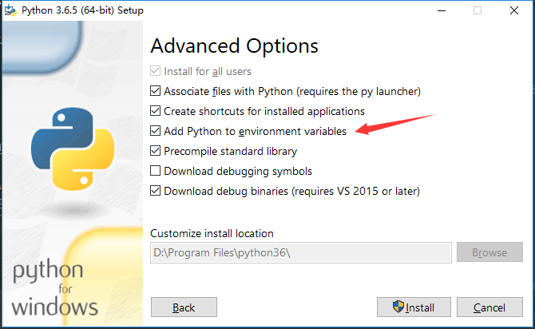
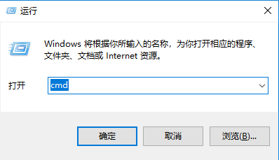
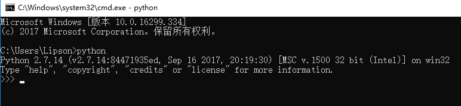
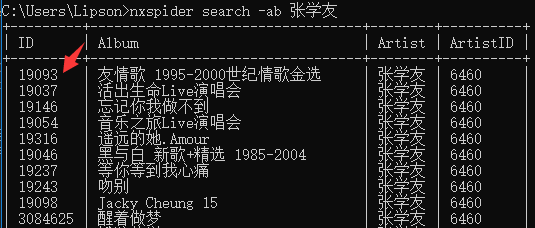

NXSpider
=================

NXSpider, NetEase X Spider, A powerful for mp3,mv spider, can help you download mp3 and mv with media tags. Base on python, mongodb, and recursion algorithm

[](LICENSE.md)


[新手先看这里](SIMPLE_USE.md) | [历史版本在这里](VERSION.md) | [开发详情在这里](DEV.md)

这里为非IT同学增加最简单使用方法（请保证电脑能上网），请根据以下流程。注意，所有跳转建议按住ctrl后再点击（或右键新窗口打开）

### 点赞
- 请给项目点个star
- 请感谢网易云，感谢上帝，感谢国家，顺便的话感谢作者

## Linux用户
[摸着自己的良心说，到底是不是IT人员](README.md)

## Mac用户
待补充

## Windows用户

### 下载python3(自行跳过)
- [点击这里下载(32)](https://www.python.org/ftp/python/3.6.5/python-3.6.5.exe) 或 [点击这里下载(64)](https://www.python.org/ftp/python/3.6.5/python-3.6.5-amd64.exe) 或 [自行选择](https://www.python.org/downloads/release/python-365/)
- 双击你下载的文件，进行安装，跟正常安装软件一样
- 推荐大概在第一页勾选 ```for all users```
- 推荐大概在第二页选择自定义安装路径，大概是 ```C:\Program Files```
- **强烈要求**大概在第二页勾选 ```Add Python to environment variables```

- 后面一直按继续即可
- 安装完毕后按住键盘 ```ctrl+r``` 在开始建附近会弹出个运行框，输入 ```cmd``` 回车

- 回车后会弹出个黑色界面，通常我们叫 console(控制台)，输入 ```python``` 并回车
- 看到以下界面则为安装成功


### 下载本项目
- [点击这里下载](https://github.com/Grass-CLP/NXSpider/archive/master.zip) 或者点击右上角 ```clone or download``` 选择zip
- 解压缩到你想要的目录下，比如 ```G:/NXSpider``` 并进入目录
- 双击目录下文件 ```install.bat``` 会弹出个窗，等待结束（希望没看到error）

### 运行本项目
1. 双击运行目录下 `start.bat` 
2. 在控制台中就可以输入说明中的命令了(可以ctrl+c ctrl+v或右键复制)
3. 建议先输入 ```nxspider -h```
3. 先配置你的下载目录，比如目录是 ```G:/media```, 则输入并回车 ```nxspider config-spider -path G:/media```
4. **推荐**打开你的网易云音乐，点击:本地音乐 -> 选择目录 -> 添加文件夹 -> 选择你的目录 -> 确定

### 通过搜索下载歌神某专辑示例
    $ nxspider search -ar 张学友
    $ nxspider sab -ab 19093 -dw mp3,mv 
    # -dw mp3,mv表示想要下载mp3和mv，不想下载mv则删除最后的,mv
    
搜索歌神唱片找到ID：



爬专辑19093：


### 暴力下载最火歌单(不截图了)
    $ nxspider scls-pls -cls 全部 -dw mp3,mv


### tips
- 其他命令见 [README.md](README.md)
- 目前暂时没做很好的退出，想退出直接把控制台(黑窗)关掉就好
- 目前暂时没做很好的重试，每次输入命令前复制到txt里面，遇到卡住的话，关掉重新打开个重新输入运行就可以
- 下载后重新进去网易云音乐，看看你的本地音乐，点击**匹配音乐**，是不是充满惊喜

## 最后
有其他问题请到issue下留言，或者发邮件给我LipsonChan的雅虎邮箱